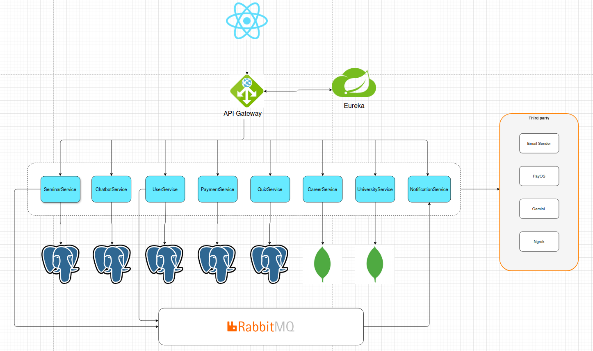

# career-path-personality-assessment
The system is able to suggest a career path for students based their personality

## Introduction 💗💎❤️

Welcome to the project of `career-path-personality-assessment`. This is microservice Java backend designed to
handle the server-side logic and data processing for my application.

## Technology used 🌀
✅ Before you begin, ensure you have met the following requirements:

- Java Development Kit `(JDK) 21` or higher installed.
- Spring Boot.
- Hibernate, JPA.
- Restfull API.
- Build tool (`Maven`) installed.
- Database system (`MongoDB`,`Postgres`) set up and configured.
- Docker compose
- Send message and receiver using RabbitMQ Broker.
- AI Chatbot
- PayOS for payment transaction.

## Key Backend Features

- User authentication with JWT token    
  - Role-based access control for students, parents, admins, and event managers
- Personality test management (MBTI, Holland Code, Big Five)
- Personalized recommendations based on test results
  - University, career, and major database management
- Event creation, registration, and feedback tracking
  - AI chatbot integration for querying guidance data
    - RESTful API design with secure endpoints and validations                 


## Backend Architecture



## Getting Started

Follow these steps to set up and run the backend:

1. Clone the repository:

```bash
   git clone https://github.com/baopen753/career-path-personality-assessment.git
```

#### 1. Navigate to the project directory:

```bash
  cd career-path-personality-assessment
```

#### 2. Run the application:

```bash
  # Using Maven
  cd docker-compose
  docker compose -f docker-compose-infras.yml -f docker-compose-microservice.yml up --build -d
  docker compose -f docker-compose-payment.yml up --build -d
```
